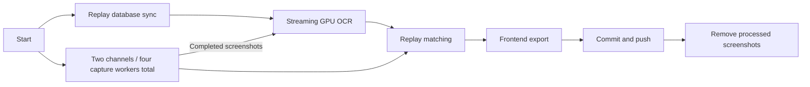

# BAR Video Battle Finder

This repository contains a complete pipeline designed to find and link Beyond All Reason (BAR) gameplay moments from YouTube videos to their specific, corresponding battle replays.

It works by scraping YouTube channels for BAR content, using computer vision (YOLO) to find player lists in screenshots, performing OCR to extract player names, and then fuzzy-matching those names against a comprehensive SQLite database of all official BAR replays.

The final result is a searchable web frontend that allows you to find videos of a specific player or fuzzy-search for a player name and get a direct link to the YouTube video and timestamp where they appeared.

## Features

  * **YouTube Scraper**: Downloads video metadata and screenshots from specified channels using `yt-dlp`.
  * **Replay Database Ingestion**: Pulls all battle replay metadata from the official `api.bar-rts.com` into a local SQLite database.
  * **Custom CV Model**: Includes a complete tool (`bbox.py`) to label, train, and run a YOLO model to detect the in-game player UI panel.
  * **High-Performance OCR**: Uses `RapidOCR` to extract player names from the detected UI panels.
  * **Incremental Matching**: Uses `rapidfuzz` to link OCR player lists to replays, with a persistent cache that recomputes only videos affected by OCR or replay changes.
  * **Web Frontend**: A responsive static site with background autocomplete, player/map search, channel and upload-date filters, shareable searches, and paginated video links.

## How It Works

This project is a multi-stage pipeline. The scripts must be run in a specific order to correctly build the dataset.

### One-Time Setup: Training the CV Model

Before you can process screenshots, you need to train the YOLO model to find the player list.

1.  **Collect Screenshots**: Manually gather a few hundred screenshots from BAR videos and place them in the `training_screenshots` folder, use `scrape.py` to make this easier.
2.  **Label Data**: Run `python bbox.py label`. This opens an OpenCV window. Click the top-left corner of the player UI panel. The bottom-right is assumed to be the edge of the screen. Press `SPACE` to save and advance.
3.  **Train Model**: Run `python bbox.py train`. This uses the labels you just created to train a YOLO model. It will save the best model as `ui_detector.pt`.

-----

### Main Pipeline: Running the Process

Once you have a trained `ui_detector.pt` model, you can run the main pipeline.

1.  **Update DB Schema**: (Run once)
    `python updateSchema.py`

      * This adds the `videos` and `battle_videos` tables to the database, which are needed to link replays to videos.

2.  **Populate Replay DB**:
    `python updateBattleDB.py`

      * This script connects to the `api.bar-rts.com` and downloads the metadata for *all* battles back to a particular date, including player names for each battle. It stores this in `game_battles.db`. This can be run periodically to fetch new replays.

3.  **Scrape YouTube Videos**:
    `python scrape.py`

      * This script reads the list of YouTube channels and uses `yt-dlp` to fetch video metadata (saving to `data/screenshot_data.json`).
      * It uses `ffmpeg` to take screenshots at 1:30 and every 12 minutes thereafter, saving them to `data/AllBarScreenshots/`.
      * Rerunning fills missing timestamps while preserving existing screenshots and OCR results. A video is complete only when every expected timestamp has a complete PNG or a saved OCR result (including an empty player list).
      * Captures start as metadata arrives, with four concurrent workers. Failed streams try alternate formats and one URL refresh; incomplete captures remain eligible for the next run. The console includes FFmpeg errors and a per-source summary.
      * Ongoing livestreams and videos with only segmented DASH streams are deferred. Rerun after YouTube makes a seekable recording available.

4.  **Run OCR on Screenshots**:
    `python processScreenshotsRapidOCR.py`

      * Uses one GPU model instance per stage, batched YOLO panel detection, and PP-OCRv6 through RapidOCR's PyTorch backend. AMD ROCm uses the same `cuda` device interface as NVIDIA. CPU is selected automatically if no GPU is available.
      * Uses larger recognition batches, skips rotation classification for upright screenshots, and tunes detection for small, dim player names. The local `players` table helps correct unambiguous OCR typos while preserving digits, clan tags, and Unicode names.
      * Updates `data/screenshot_data.json` with atomic checkpoints every 50 frames and at completion/interruption. Completed frames are skipped before models load. Valid empty results are saved; failed frames remain eligible for retry and stop the enclosing pipeline before screenshot cleanup.
      * Override defaults with `--device cpu`, `--device cuda:0`, `--batch-size 4`, or `--checkpoint-every 10`. Use `--reprocess` to replace saved results for screenshots still on disk. Rerun with the same flag if a reprocessing attempt fails.
      * For an isolated evaluation: `python processScreenshotsRapidOCR.py --screenshots-dir path/to/samples --output-file data/ocr-evaluation.json`. See [OCR benchmark results](docs/ocr-benchmark.md) for the model comparison and limitations.

5.  **Match OCR to Replays**:
    `python findScreenshotBattles.py`

      * Reads OCR player lists from `data/screenshot_data.json` and reuses matching results stored in `data/game_battles.db`. Unchanged runs skip loading the battle history entirely.
      * New OCR results and changes to battles within a video's eight-month search window invalidate that video's cache. Database triggers track replay insertions, corrections, roster edits, and deletions; newer battles leave older uploads cached.
      * Small updates use an indexed player lookup to load only candidate battles and their rosters. The supporting index is built once, on the first small update.
      * It uses a parallelized process and `rapidfuzz`'s `token_set_ratio` to find the best `battle_id` that matches the list of players in each screenshot.
      * It saves these matches (e.g., "Video X at timestamp Y matches Battle ID Z") into the `battle_videos` table in `game_battles.db` and also creates `matches_output.json`.
      * Use `--force` to rebuild every match, or `--max-workers 4` to limit worker processes. The first run populates the cache; changing matching settings also invalidates it.

6.  **Export for Frontend**:
    `python exportForFrontend.py`

      * Reads linked data directly from a consistent SQLite snapshot, with no scraping or OCR needed.
      * Writes a compact `frontend_files/catalog.<hash>.json`, storing each video and battle once. `frontend_files/frontend_data.json` is now a small manifest pointing to that catalog.
      * Unchanged catalogs keep the same filename for browser caching. The manifest is replaced atomically after the catalog is ready, and the previous catalog is retained for tabs loading during an update. Deploy the manifest and catalog files together.

7.  **View Results**:

      * Serve the repository folder with a simple HTTP server (e.g., `python -m http.server`) and open `index.html` in your browser. Use HTTP rather than opening the file directly: search runs in a module Web Worker.
      * Data loading, indexing, autocomplete, and filtering run in the worker. The page receives at most eight suggestions or 24 results at a time and loads thumbnails as they approach the viewport.
      * Player names retain clan tags and Unicode. Search supports case-insensitive names and typo suggestions, with keyboard navigation. Channel, upload-date, sort, and page selections are included in copied search links; existing `?playerName=...` links still work.
      * The original BAR SVG logo, favicon, Poppins typeface, and blue/charcoal styling are retained. Branding and font files are served locally; asset sources and the font license are in [frontend_files/assets](frontend_files/assets/README.md).

## Setup & Installation

1.  **Clone Repository**

    ```bash
    git clone https://github.com/csirikak/BAR-Youtube-Finder.git
    cd BAR-Youtube-Finder
    ```

2.  **Create Python Environment**

    ```bash
    python -m venv venv
    source venv/bin/activate  # On Windows: venv\Scripts\activate
    ```

3.  **Install Python Dependencies**
    ```bash
    pip install -U "yt-dlp[default]" "bgutil-ytdlp-pot-provider>=2.0.0" curl_cffi requests python-dateutil
    pip install opencv-python numpy
    pip install ultralytics "rapidocr==3.9.2" rapidfuzz
    ```
    Install a PyTorch build appropriate for your GPU before these commands. For AMD, keep `torch`, `torchvision`, and `triton` on compatible ROCm builds; do not replace a working AMD installation with generic PyPI wheels. OCR uses the `rapidocr` package and its Torch backend, not the older `rapidocr-onnxruntime` package. RapidOCR downloads its model weights on first use. The player-name database is optional; without it, names are returned without catalog corrections.

4.  **Install External Dependencies**

      * **FFmpeg**: You must have `ffmpeg` installed and available in your system's `PATH`. This is required by `scrape.py` for taking screenshots.
      * **YouTube JavaScript support**: Install a supported Deno or Node.js runtime (Node 22+ for the PO provider) and keep `yt-dlp[default]` current so its EJS challenge solver is installed. The scraper enables both runtimes. See the [yt-dlp EJS setup guide](https://github.com/yt-dlp/yt-dlp/wiki/EJS).
      * **YouTube PO tokens**: Some streams require a token provider. Install `bgutil-ytdlp-pot-provider` in the same Python environment and follow its [provider setup instructions](https://github.com/Brainicism/bgutil-ytdlp-pot-provider#installation). Keep the Python plugin and provider checkout on matching releases; use [2.0.0 or newer for its HTTP server security fixes](https://github.com/Brainicism/bgutil-ytdlp-pot-provider/releases/tag/2.0.0). After updating the checkout, rebuild it with `npm ci` and `npx tsc` in its `server` directory. The scraper uses its HTTP server when available, or its script when built at `bgutil-ytdlp-pot-provider/server/build/generate_once.js` inside this repository. See the [yt-dlp PO Token Guide](https://github.com/yt-dlp/yt-dlp/wiki/PO-Token-Guide).
      * **(Optional)** `exiftool` or `imagemagick`: The `delete.sh` script uses these.

## Usage (Pipeline Order)

For the complete update, run `python update_pipeline.py`. The local
`update.py` entry point delegates to the same runner. It preserves the existing
commit/push and screenshot-cleanup steps after a successful update.



Replay sync runs alongside channel discovery and screenshot capture. Once the
database commits, OCR reads the current player catalog and processes screenshots
as they arrive. A shared metadata lock and merged OCR checkpoints preserve both
new video metadata and recognition results. Duplicate video IDs are claimed once
per run, and all channels share one bounded capture pool.

The runner prints elapsed time for each stage and total wall time. Concurrent
stage times include waits and should not be added together. Matching and export
wait for their inputs; failed prerequisites, exports, or pushes stop cleanup.
On cancellation, new work stops and in-flight requests finish within their
timeouts. Successful OCR results remain checkpointed for the next run.

```bash
# Run the update while retaining screenshots and omitting commit/push.
python update_pipeline.py --no-publish --keep-screenshots

# Adjust concurrency; defaults shown.
python update_pipeline.py --channel-workers 2 --capture-workers 4 --ocr-batch-size 8
```

Use `--no-warp` to leave the current network connection alone, or
`--no-provider` when managing the PO provider separately. An existing healthy
provider is reused; a provider started by this runner is stopped on exit.
Configure the curated channel list in `update_pipeline.py`.

Regression tests (no YouTube requests or GPU required):

```bash
python -m unittest discover -s tests -v
node --test tests/search.test.mjs
```

See [performance measurements and cache behavior](docs/performance.md) for
the update and browser benchmarks, including an optional browser smoke test.

The individual stages can also be run in order:

```bash
# --- ONE-TIME SETUP ---
# 1. Manually add screenshots, then label them
python bbox.py label

# 2. Train the YOLO model
python bbox.py train

# 3. Add the new tables to the database
python updateSchema.py

# --- REGULAR PIPELINE RUN ---
# 1. Update the battle replay database
python updateBattleDB.py

# 2. Scrape YouTube for new videos and screenshots
python scrape.py

# 3. Process new screenshots with OCR
python processScreenshotsRapidOCR.py

# 4. Run the matching logic
python findScreenshotBattles.py

# 5. Export the final data for the website
python exportForFrontend.py

# 6. Serve the frontend
python -m http.server 8000
# ...then open http://localhost:8000 in your browser
```

## 📂 Project Structure

```
.
├── data/
│   ├── AllBarScreenshots/       # (Generated) Directory for all .png screenshots
│   ├── game_battles.db          # (Generated) SQLite DB of all BAR replays
│   ├── matches_output.json      # (Generated) Intermediate JSON of video/battle matches
│   └── screenshot_data.json     # (Generated) JSON DB of video metadata and OCR results
├── frontend_files/
│   ├── app.js               # JavaScript for the frontend
│   ├── frontend_data.json   # (Generated) Small catalog manifest
│   ├── catalog.<hash>.json  # (Generated) Compact shared data
│   ├── search-core.js      # Search indexes and pure query logic
│   ├── search-worker.js    # Background loading, autocomplete, and filtering
│   └── style.css            # CSS for the frontend
├── yolo_dataset/            # (Generated) Staging area for YOLO training
├── yolo_labels/             # (Generated) Labels from bbox.py
│
├── bbox.py                  # Tool for labeling, training, and inferring with YOLO
├── exportForFrontend.py     # Exports final data to frontend_files/frontend_data.json
├── findScreenshotBattles.py # **Core Logic**: Matches OCR results to the DB
├── match_cache.py           # Persistent matching cache and replay change tracking
├── json_files.py            # Atomic JSON publishing
├── index.html               # The web frontend UI
├── processScreenshotsRapidOCR.py # Runs YOLO + OCR on all screenshots
├── scrape.py                # Scrapes YouTube channels for videos & screenshots
├── updateBattleDB.py        # Populates game_battles.db from the BAR API
├── update_pipeline.py       # Concurrent capture, replay sync, and streaming OCR
├── updateSchema.py          # Adds video/match tables to the DB
│
└── ui_detector.pt           # (Generated) The trained YOLO model
```
